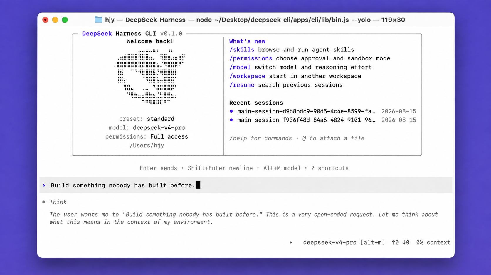

<p align="center"><strong>DeepSeek CLI</strong> is an open-source coding agent powered by DeepSeek that runs locally in your terminal.</p>

&#8203;<div align="center">English | [中文](README.zh.md)</div>

<p align="center">
  
</p>

<p align="center"><strong>9 interface languages · 6 theme palettes · Agentic coding from plan to execution</strong></p>

<p align="center">
  
</p>

---

**Note:** This is DeepSeek Harness CLI. We keep iterating in sync with the official [DeepSeek Harness](https://github.com/deepseek-ai/deepseek-harness), and we look forward to your forks and stars.

<a id="run"></a>

## Quickstart

### Install

macOS or Linux:

```sh
curl -fsSL https://raw.githubusercontent.com/peiyuwang54/deepseek-harness-cli/master/apps/cli/install/install.sh | sh
```

<a id="install-windows"></a>

Windows:

```powershell
powershell -ExecutionPolicy Bypass -c "irm https://raw.githubusercontent.com/peiyuwang54/deepseek-harness-cli/master/apps/cli/install/install.ps1 | iex"
```

You can also install DeepSeek CLI with the following package managers:

```sh
# Install using npm
npm install -g @peiyu_wang/deepseek-harness-cli
```

```sh
# Install using Homebrew
brew install --cask peiyuwang54/dsh/deepseek-harness-cli
```

Then open a project directory and run `deepseek` to get started. The shorter `dsh` alias is also available:

```sh
deepseek
# or
dsh
```

Run a non-interactive task for scripts and CI with `deepseek exec`:

```sh
deepseek exec "run the tests"
deepseek exec --json "review this repository"
deepseek exec resume --last "continue"
```

On first launch, paste your DeepSeek API key into the masked prompt. The key is stored by the shared credential provider and never added to chat history. Use `/credentials` to inspect its source, replace it, or remove the saved value.

For automation, set `DEEPSEEK_API_KEY` before launch (`$env:DEEPSEEK_API_KEY="your-key"` in PowerShell). An inherited environment value is read-only inside the CLI.

### Permission modes

```sh
deepseek
deepseek --full-auto
deepseek --yolo
deepseek --sandbox read-only --ask-for-approval ask
deepseek exec --sandbox workspace-write --ask-for-approval never "review this repository"
```

Use `--sandbox` to select `read-only`, `workspace-write`, or `danger-full-access`; use `--ask-for-approval` to select `ask` or `never`. The explicit controls persist with the session and cannot be combined with `--full-auto` or `--yolo`. `--yolo` is dangerous and belongs only in an isolated environment. Use `/permissions` to switch to a named preset during a session.

Add another writable project directory while keeping `workspace-write` confinement:

```sh
deepseek --add-dir ../shared
deepseek exec --add-dir ../shared "update both projects"
```

Repeat `--add-dir` for multiple directories. Relative paths resolve from the starting project directory and remain attached when the session is resumed. The option does not make a `read-only` session writable.

### MCP servers

```sh
deepseek mcp add filesystem -- npx -y @modelcontextprotocol/server-filesystem .
deepseek mcp add remote --url https://example.com/mcp --header Authorization=MCP_TOKEN
deepseek mcp list
deepseek mcp remove filesystem
```

`--env KEY[=SOURCE]` and `--header NAME=SOURCE` save environment-variable references, not secret values. Restart the CLI after an add, remove, enable, or disable. Inside a running session, use `/mcp`, `/mcp tools`, `/mcp desc`, `/mcp schema`, `/mcp resources`, or `/mcp prompts` to inspect live MCP capabilities, and `/mcp reload [server]` to reconnect the current configuration.

Diagnose an installation without starting a profile, or install shell completion for both command names:

```sh
deepseek doctor
deepseek doctor --json
deepseek completion zsh > ~/.zsh/completions/_deepseek
```

`doctor` also checks shipped profile overlays and presets, the optional Web frontend asset, installation channel, sandbox runner, truecolor, mouse input, and clipboard support. Host capability checks are warnings; a missing runtime asset or unsupported Node version is blocking.

Inspect and validate a profile's installed plugin bundles without starting it:

```sh
deepseek plugin --profile tui list
deepseek plugin --profile tui verify --json
deepseek plugin --profile tui source <package>
deepseek plugin --profile tui disable <package>
deepseek plugin --profile tui enable <package>
deepseek plugin --profile tui install <package>
deepseek plugin --profile tui update
```

`source` shows the package directory and declared repository. `enable` and `disable` change the active Cordis bundle list and take effect on the next launch; `install`, `update`, and `remove` use pnpm for dependency resolution.

## What it includes

- Code reading, editing, shell tools, web search, skills, MCP, and subagents.
- Persistent sessions with resume, plan, goal, queued messages, and automatic context compaction.
- A Codex-style terminal UI with six theme palettes and English, Simplified Chinese, Traditional Chinese, Arabic, French, Russian, Spanish, Japanese, and Korean.
- Plugin-based profiles for terminal, headless automation, and the Web UI.

<a id="run-from-source"></a>

## Run from source

```sh
git clone https://github.com/peiyuwang54/deepseek-harness-cli.git
cd deepseek-harness-cli
pnpm install --frozen-lockfile
pnpm run build
pnpm dsh
```

Source builds require Node.js `^22.19` or `>=24` and pnpm `11.7.0`.

## Docs

- [CLI commands and profiles](apps/cli/reference/README.md)
- [Terminal UI and slash commands](packages/ui/tui/README.md)
- [Configuration reference](docs/config-catalog.md)
- [Architecture](docs/architecture.md)
- [Development](docs/development.md)

Report bugs in [GitHub Issues](https://github.com/peiyuwang54/deepseek-harness-cli/issues).

## License

This project is licensed under MIT. Restored TUI code retains its BSD-3-Clause notice; see [THIRD_PARTY_NOTICES.md](THIRD_PARTY_NOTICES.md).

## Community

- LinuxDo — <https://linux.do>
