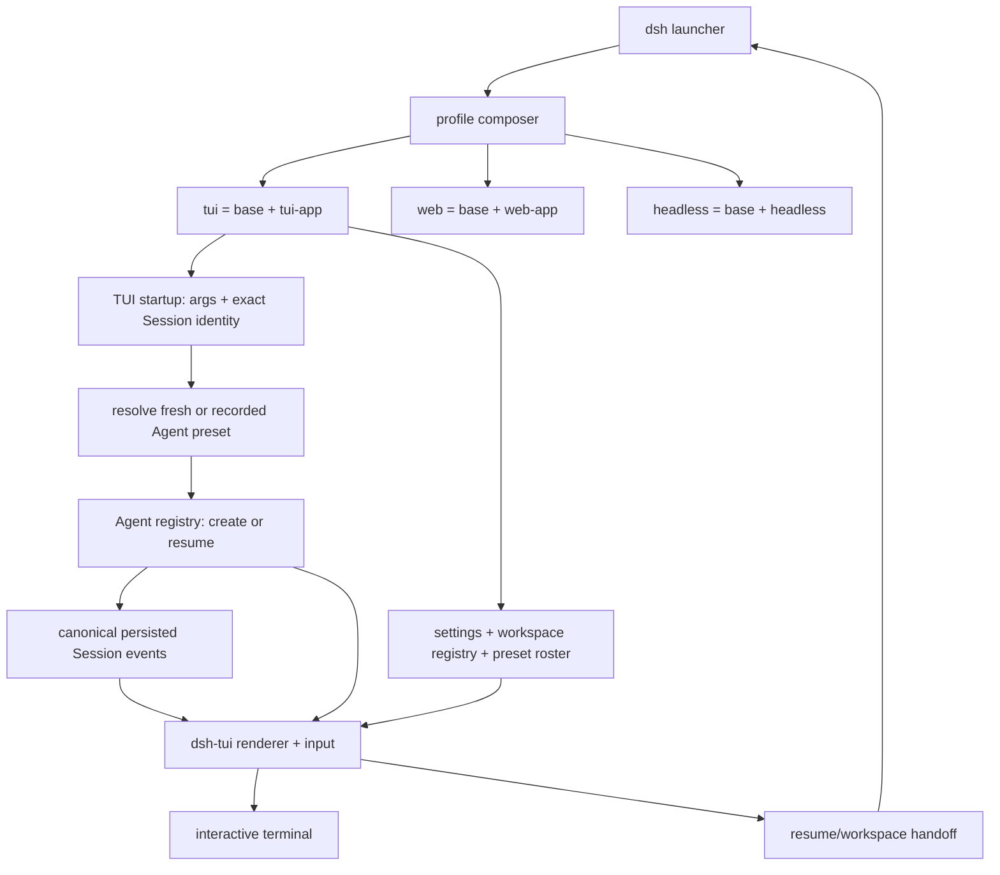

# DeepSeek Harness Web-to-CLI

English | [中文](README.zh.md)

This community-maintained fork adds a first-class interactive terminal UI (TUI) and CLI entry point to [DeepSeek Harness](https://github.com/deepseek-ai/deepseek-harness), while retaining its Web and one-shot headless surfaces. The result is one plugin-based agent runtime with three explicit front doors:

| Surface | Source-checkout command | Intended use |
|---|---|---|
| Terminal | `pnpm dsh tui` | Interactive coding-agent work in a terminal, SSH session, or tmux |
| Headless | `pnpm dsh --profile headless "task"` | Scripts, pipes, CI jobs, and one-shot automation |
| Web | `pnpm dsh web` | The existing browser UI, served at `http://127.0.0.1:3080` by default |

> [!IMPORTANT]
>
> This is an unofficial community fork. It is not maintained, sponsored, or endorsed by DeepSeek AI. DeepSeek Harness and the `@deepseek-ai` npm packages originate from DeepSeek AI. The terminal changes in this repository are currently distributed from source; the public `@deepseek-ai/dsh` npm package is an independent upstream release and must not be assumed to contain this fork's TUI.

## Status

This project is a developer preview. Configuration, package APIs, session formats, commands, and terminal behavior may change incompatibly. Keep backups of important work and review the permission and credential notes below before using an agent on sensitive repositories.

## Requirements

- Node.js `^22.19.0` or `>=24.0.0`; Node.js 24 is the recommended development runtime.
- pnpm `11.7.0`, matching the repository's `packageManager` field.
- A real stdin and stdout TTY for `tui`; use `headless` for redirection and automation.
- A provider credential before the first model request. The shipped default adapter reads `DEEPSEEK_API_KEY`.

The terminal implementation targets macOS, Linux, and Windows. The keyless built-binary PTY acceptance test described below runs on POSIX; Windows terminal behavior uses the pi-tui VT-input and ConPTY paths and has separate platform-oriented tests.

<a id="run-from-source"></a>

## Quick start from source

```sh
git clone https://github.com/peiyuwang54/deepseek-harness-web-to-cli.git
cd deepseek-harness-web-to-cli
pnpm install --frozen-lockfile
pnpm run build
export DEEPSEEK_API_KEY="your-key"
pnpm dsh tui
```

PowerShell credential setup:

```powershell
$env:DEEPSEEK_API_KEY = "your-key"
pnpm dsh tui
```

Do not commit provider keys. Besides the inherited environment, the launcher can resolve credentials from `$DSH_HOME/.credentials.yaml`, the invocation directory's `.env`, and `$DSH_HOME/.env`. `$DSH_HOME` defaults to `~/.dsh`; it also contains profiles and persisted sessions.

The directory in which you run `pnpm dsh ...` is the default workspace. The `web`, `tui`, and `headless` profiles initialize themselves on first use.

<a id="run"></a>

## Running the three surfaces

### Interactive terminal

Start a new persistent session:

```sh
pnpm dsh tui
```

Show terminal-specific help or resume a known session directly:

```sh
pnpm dsh tui --help
pnpm dsh tui --resume <session-id>
```

The launcher prints the session ID and a resume command when the terminal exits. Direct `--resume` is the supported default-profile resume path. Run it from the workspace in which you want to continue working.

### Headless automation

```sh
pnpm dsh --profile headless "inspect the repository and summarize the test failures"
```

Headless mode creates one fresh persisted Agent, writes the final non-empty assistant answer to stdout, and exits. It mounts no Web server or terminal renderer. An absent task is a usage error, and a non-completed turn exits nonzero.

### Web UI

```sh
pnpm dsh web
pnpm dsh web --port 8080
```

The Web surface remains a separate `base + web-app` profile. Adding the TUI does not route Web traffic through the terminal renderer and does not remove the browser client. See the [Web UI guide](docs/user/guide/index.md).

## TUI capabilities

The terminal is an independent presentation layer over the same Agent, Session, Tool, Command, Approval, model, skill, and persistence services used elsewhere in Harness.

| Area | Implemented behavior |
|---|---|
| Conversation | Streaming GFM Markdown, semantic `diff`/`patch` fences, reasoning blocks, retry state, timing, and persisted-history replay |
| Tools | Terminal, diff, and generic cards; pending/success/error state; collapsed, expanded, and hidden views |
| Human in the loop | Exact-Agent FIFO approval prompts plus structured single-select, multi-select, and custom questions |
| Models | `/model`, Alt+M, and a clickable model badge; catalog filtering, exact provider/model selection, and reasoning effort |
| Sessions | Direct and in-channel resume, Web-preset-safe composition restore, titles, compaction markers, and session references |
| Workspace | Searchable durable workspace selector, fresh-process handoff, and bounded `@` file/directory completion |
| Settings | Redacted settings hub/document discovery plus persistent shared light, dark, and system theme selection |
| Skills and commands | Dynamic slash-command completion and `/skill:<name> [instructions]` for user-invocable skills |
| Diagnostics | Token and KV-cache accounting, context pressure, current model, `/status`, and terminal-safe error reporting |
| Extensibility | Agent-scoped commands, tool-owned presentation intents, and a lifecycle-bound `ctx.tui` overlay service |
| Terminal lifecycle | Full-screen alternate buffer, multiline editor, mouse input, scrollable transcript, raw mode, and complete restoration |

`@path` completion inserts a path into the user message; it does not secretly read or attach that file. When a `read` tool is available, the model receives a stable instruction to read an explicitly referenced path when its contents are needed.

### Keyboard shortcuts

| Key | Action |
|---|---|
| `Enter` | Send a follow-up while idle or steering input while the Agent is running |
| `Shift+Enter` / `Alt+Enter` | Insert a newline |
| `Up` / `Down` | Navigate prompt history when the editor owns those keys |
| `Alt+M` | Open the model selector |
| `Page Up` / `Page Down` | Scroll the full-screen transcript by one page |
| `Ctrl+End` | Return to the live transcript tail |
| Mouse wheel / model click | Scroll transcript or selectors; open the model selector from its badge |
| `Esc` | Cancel the active turn |
| `Ctrl+C` | Cancel while running; while idle, clear non-empty input, then exit when pressed on an empty editor |
| `Ctrl+D` | Exit while idle |
| `Ctrl+O` | Cycle tool cards through collapsed, expanded, and hidden |
| `Ctrl+R` | Toggle reasoning-block visibility |
| `Ctrl+L` | Force a full redraw |

### Terminal commands

| Command | Purpose |
|---|---|
| `/help` | Show current shortcuts and the effective command registry |
| `/model [[provider/]model]` | Open the selector or choose an unambiguous target directly |
| `/permissions [preset]` | Open the permission picker, or switch directly to a named sandbox-and-approval preset |
| `/yolo` | **Dangerous:** disable the sandbox and approval prompts; the result prints the recovery command |
| `/clear` | Clear only the rendered transcript; durable session history is unchanged |
| `/details` | Change tool-card visibility and reasoning display |
| `/palette` | Inspect the semantic ANSI palette |
| `/status` | Add session, model, usage, system-prompt, and tool diagnostics to the terminal transcript |
| `/resume` | Search persisted sessions and replace the process in the session's recorded workspace |
| `/workspace [directory]` | Search or register workspaces and start a fresh session in the selected directory |
| `/settings [list\|document]` | Inspect redacted settings metadata or locate the shared editable settings document |
| `/theme [light\|dark\|system]` | Select and persist the shared appearance preference |
| `/reload` | Experimental development-only reload of file-backed Loader configuration while idle |
| `/exit` / `/quit` | Exit after the active turn reaches idle |
| `/skill:<name> [instructions]` | Load a user-invocable skill as a user turn |

Other plugins can contribute Agent-scoped commands, which appear dynamically in completion and `/help`.

## Architecture

Everything remains a Cordis plugin. The CLI selects a profile, the profile composer layers bundles and user patches, and the selected surface owns its process boundary.



`@deepseek-ai/dsh-tui-app` owns `--resume`, TTY admission, the exact root Agent identity, and Agent create/resume. It waits for the Loader tree, resolves and mounts the fresh or historically recorded Agent preset while the Agent is unpublished, installs the initial model route, and then mounts `@deepseek-ai/dsh-tui`. This makes a Web-created `minimal`, `standard`, `code`, or other preset session resume with the same tool and prompt composition instead of today's default. The renderer owns presentation and input only.

The launcher supplies the process handoff used by `/resume` and `/workspace`. After the renderer validates idle state, flushes the current session, drains input, and releases raw/mouse/alternate-screen modes, the launcher replaces the process in the target directory on POSIX or supervises one foreground replacement child on platforms without `execve`. Profile patches and the original inherited environment are preserved without leaking the old workspace's `.env` values into the new one.

Canonical Session events are the sole durable conversation source. Streaming chunks, tool progress, questions, approvals, and overlays are live projections rather than a second chat log. Approval policy and durable audit events remain owned by `ctx.approval`; the TUI is only the exact-Agent answerer. Structured questions remain a separate `ctx.userQuestions` service.

The implementation decision, API migration, lifecycle contracts, testing boundary, and source provenance are recorded in the [shipped TUI CLI Agent Note](.agents/notes/implemented/feature/2026-08-14-shipped-tui-cli-front-door.md).

## Profiles, configuration, and plugins

Each profile lives under `$DSH_HOME/profiles/<name>`. The effective tree applies these layers in order:

1. Bundle patches in the profile's `dsh.profile.bundles` order.
2. The profile's `cordis.patch.yml`.
3. The shared `$DSH_HOME/cordis.patch.yml`.
4. Repeatable `--patch <path>` overlays in command-line order.

Later layers win by row, and replacing a row's `config` replaces that complete value rather than deep-merging it. Inspect or extend the TUI profile without booting it:

```sh
pnpm dsh tui --dump-default-config
pnpm dsh tui --dump-config
pnpm dsh tui --patch ./extra.cordis.yml
pnpm dsh plugin --profile tui add <package-or-git-spec>
```

Launcher flags such as `--patch` must appear before app-owned arguments such as `--resume`:

```sh
pnpm dsh tui --patch ./extra.cordis.yml --resume <session-id>
```

See the [CLI behavior reference](apps/cli/reference/README.md), the [TUI renderer reference](packages/ui/tui/README.md), and the [configuration catalog](docs/config-catalog.md) for the full layer, schema, and extension contracts.

## Security and privacy boundaries

- New sessions default to `workspace-write` with approval prompts. Enforced file mutations are confined to the session workspace and platform temporary roots, but reads, network access, and process visibility are not a complete sandbox boundary.
- `/yolo` deliberately switches the current session to the configured `danger-full-access + never` preset. It executes without another confirmation because entering the explicit command is the confirmation; use only in an externally isolated environment, and restore the safer preset with the command printed in its result.
- `DSH_PERMISSION_MODE=danger-full-access` removes the normal file boundary and changes the shipped approval policy to `never`. Use it only in an already isolated environment.
- Environment credentials are process-visible. `$DSH_HOME/.credentials.yaml` is a plain file protected from accidental disclosure, not an OS keychain; another same-user process can read it.
- External plugins and MCP server commands are trusted executable code loaded outside the Agent's tool sandbox. Review a plugin and its install scripts before adding it to a profile.
- Session telemetry is disabled by default. If explicitly enabled, the shipped exporter can include message text, tool arguments and results, and workspace paths. Any non-empty `DSH_TELEMETRY_DISABLED` is a hard opt-out.
- The TUI makes untrusted C0/C1 terminal controls visible instead of executing them and restores terminal mode during normal disposal. This protects the display boundary; it does not make model-selected shell commands safe.

## Verification

The CLI/TUI baseline was locally validated before publication with the following results:

- Full workspace build completed.
- TUI unit and Agent/Session integration suites: 259 tests passed.
- Keyless terminal-state snapshots: 28 snapshots passed.
- TUI bundle and CLI argument suites: 26 tests passed across 5 files.
- Built CLI E2E suite: 21 tests passed, including real POSIX PTY launches of `apps/cli/lib/bin.js` that prove Loader activation, synchronized frames, active raw mode, `Ctrl+D` exit, workspace process handoff with environment rebasing, and complete termios restoration.
- Type, package, Loader/config, generated-catalog, documentation-link, translation-pairing, license, and third-party-notice gates completed for the baseline.

These are dated local baseline results, not a GitHub Actions badge or a promise that every later commit is green. The PTY path is keyless and makes no model request; it does not replace a real-provider E2E run.

Useful developer commands:

```sh
pnpm run build
pnpm run typecheck
pnpm run test
pnpm run test:snapshot
pnpm exec vitest run --config vitest.e2e.config.ts apps/cli/tests/built-bin.e2e.ts
pnpm run check:ci
```

Real DeepSeek API E2E requires a separately configured credential and can spend quota. It is not implied by the keyless test results above.

## Known limitations

- **Source distribution for this fork:** no npm package under the `@deepseek-ai` scope is published or controlled by this repository.
- **TTY only:** ordinary `tui` startup requires interactive stdin and stdout. It intentionally does not fall back to headless mode when piped.
- **No cross-process session lock:** another process can attempt to resume the same persisted identity.
- **Terminal-native Settings:** `/settings` exposes redacted namespace metadata and the editable document, while `/theme` has a dedicated control. It does not reproduce every Web plugin's specialized React settings card.
- **Text-terminal presentation:** Markdown images remain text, TeX is not typeset with KaTeX, ordinary code fences use one semantic code color rather than Shiki token highlighting, and there are no Web copy buttons or horizontal scrollers.
- **One rendered Agent:** the configured Session owns the transcript and editor, even though shared overlays may answer requests from other Agents.
- **Host workspace discovery:** `@` file completion indexes the host session directory, excludes configured directory basenames rather than interpreting `.gitignore`, and does not traverse directory symlinks.
- **No renderer module HMR:** the shipped TUI bundle disables module hot reload while raw terminal state is live; `/reload` is limited to Loader configuration and development use.

See the [complete TUI limitations](packages/ui/tui/README.md#known-limitations-and-deferred-work) and the [bundle-specific limitations](packages/bundle/tui/README.md#known-limitations-and-deferred-work).

## Provenance

The TUI renderer was recovered from the upstream DeepSeek Harness tree immediately before its removal and ported to the current Agent, Session, model-selection, Approval, user-question, compaction, and Cordis APIs. This fork's new squashed Git history does not reproduce the upstream commits; the [pre-removal upstream tree](https://github.com/deepseek-ai/deepseek-harness/tree/7248b5ec8f8769f882f12fd521504fa48e97bcf3/packages/ui/tui) preserves that traceability.

Gemini CLI and OpenAI Codex were studied for high-level process, rendering, approval, resume, headless, and PTY testing patterns. Claude-family tools were considered only through high-level observable behavior. No source or nontrivial expression from those external CLIs was copied into this implementation. The renderer uses `@earendil-works/pi-tui` as an explicit dependency with a recorded local compatibility patch.

## Development and support

- Report fork-specific bugs through this repository's [Issues](https://github.com/peiyuwang54/deepseek-harness-web-to-cli/issues), not the upstream issue tracker.
- Start with the [development guide](docs/development.md) and [architecture documentation](docs/architecture.md).
- See [CONTRIBUTING.md](CONTRIBUTING.md) before proposing a change.
- Agents working in the repository must follow [AGENTS.md](AGENTS.md).

Upstream DeepSeek Harness documentation and communities describe the upstream project; they are not a support or endorsement channel for this fork.

## License

Fork changes and the current repository baseline are distributed under the root [MIT license](LICENSE). The TUI source recovered from the earlier upstream history retains its DeepSeek copyright and [BSD-3-Clause notice](packages/ui/tui/LICENSE). Dependency licenses, the pi-tui patch, and other required notices are recorded in [THIRD_PARTY_NOTICES.md](THIRD_PARTY_NOTICES.md). Comply with each applicable notice when redistributing the combined work.
