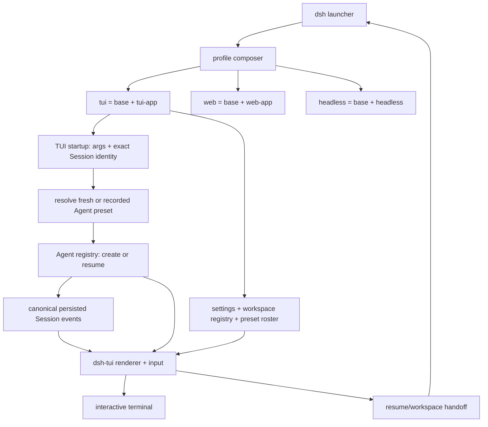

# DeepSeek Harness Web-to-CLI

[English](README.md) | 中文

这是一个由社区维护的 [DeepSeek Harness](https://github.com/deepseek-ai/deepseek-harness) fork，为原项目增加了一等的交互式终端 UI（TUI）和 CLI 入口，同时保留 Web 与单次执行的 headless 入口。最终是同一套插件化 agent 运行时，对外提供三个边界明确的入口：

| 界面 | 源码 checkout 命令 | 适用场景 |
|---|---|---|
| 终端 | `pnpm dsh tui` | 在终端、SSH 会话或 tmux 中交互式使用 coding agent |
| Headless | `pnpm dsh --profile headless "task"` | 脚本、pipe、CI 任务和单次自动化 |
| Web | `pnpm dsh web` | 原有浏览器 UI，默认服务地址为 `http://127.0.0.1:3080` |

> [!IMPORTANT]
>
> 这是一个非官方的社区 fork，不由 DeepSeek AI 维护，也未获得 DeepSeek AI 的赞助或背书。DeepSeek Harness 和 `@deepseek-ai` npm 包来自 DeepSeek AI。本仓库的终端改动目前通过源码分发；公开的 `@deepseek-ai/dsh` npm 包是上游独立发布的产物，不应默认它已包含本 fork 的 TUI。

## 状态

本项目仍处于开发者预览阶段。配置、包 API、Session 格式、命令和终端行为都可能发生破坏兼容性的变化。在敏感仓库中使用 agent 前，请备份重要工作，并阅读下文的权限与凭据说明。

## 环境要求

- Node.js `^22.19.0` 或 `>=24.0.0`；建议开发时使用 Node.js 24。
- pnpm `11.7.0`，与仓库 `packageManager` 字段一致。
- `tui` 要求 stdin 和 stdout 都是真实 TTY；重定向和自动化请使用 `headless`。
- 第一次请求模型前需要提供方凭据。随附的默认适配器读取 `DEEPSEEK_API_KEY`。

终端实现面向 macOS、Linux 和 Windows。下文介绍的无密钥 built-binary PTY 验收测试在 POSIX 上运行；Windows 终端行为使用 pi-tui 的 VT 输入和 ConPTY 路径，并配有独立的平台导向测试。

<a id="run-from-source"></a>

## 从源码快速开始

```sh
git clone https://github.com/peiyuwang54/deepseek-harness-web-to-cli.git
cd deepseek-harness-web-to-cli
pnpm install --frozen-lockfile
pnpm run build
export DEEPSEEK_API_KEY="your-key"
pnpm dsh tui
```

PowerShell 凭据设置：

```powershell
$env:DEEPSEEK_API_KEY = "your-key"
pnpm dsh tui
```

不要提交提供方密钥。除了继承的环境外，启动器还可以从 `$DSH_HOME/.credentials.yaml`、调用目录下的 `.env` 以及 `$DSH_HOME/.env` 解析凭据。`$DSH_HOME` 默认为 `~/.dsh`，其中还保存 profile 和持久化 Session。

运行 `pnpm dsh ...` 时所在的目录是默认 workspace。`web`、`tui` 和 `headless` profile 都会在首次使用时自动初始化。

<a id="run"></a>

## 运行三种入口

### 交互式终端

启动新的持久化 Session：

```sh
pnpm dsh tui
```

显示终端专用帮助，或直接恢复已知 Session：

```sh
pnpm dsh tui --help
pnpm dsh tui --resume <session-id>
```

终端退出时，启动器会打印 Session ID 和恢复命令。直接 `--resume` 是默认 profile 支持的恢复路径。请在你想继续工作的 workspace 中执行该命令。

### Headless 自动化

```sh
pnpm dsh --profile headless "inspect the repository and summarize the test failures"
```

Headless 模式会创建一个新的持久化 Agent，把最后一段非空 assistant 答案写入 stdout，然后退出。它不挂载 Web server 或终端 renderer。缺少任务属于用法错误，未完成的 turn 会以非零状态退出。

### Web UI

```sh
pnpm dsh web
pnpm dsh web --port 8080
```

Web 界面仍然是独立的 `base + web-app` profile。增加 TUI 不会让 Web 流量经过终端 renderer，也不会删除浏览器 client。详见 [Web UI 指南](docs/user/guide/index.md)。

## TUI 功能

终端是一个独立的展示层，复用 Harness 其他界面使用的 Agent、Session、Tool、Command、Approval、模型、skill 和持久化服务。

| 领域 | 已实现行为 |
|---|---|
| 对话 | 流式 GFM Markdown、语义化 `diff`/`patch` 围栏、reasoning 块、重试状态、计时和持久历史回放 |
| 工具 | 终端、diff 和通用卡片；进行中／成功／错误状态；折叠、展开和隐藏视图 |
| 人机协同 | 严格限定 Agent 的 FIFO 审批提示，以及结构化单选、多选和自定义问题 |
| 模型 | `/model`、Alt+M 与可点击模型栏；catalog 过滤、精确 provider/model 选择和 reasoning effort |
| Session | 直接与会话内恢复、安全恢复 Web preset 组成、标题、压缩标记和 Session 引用 |
| Workspace | 可搜索的持久 workspace 选择器、新进程 handoff，以及有界文件／目录 `@` 补全 |
| Settings | 脱敏的 settings hub／文档定位，以及持久化的共享亮色、暗色与 system 主题选择 |
| Skill 与命令 | 动态补全、`/skills` 浏览、`/skill:<name>`、默认／Vim 键位以及快速路由与实验功能入口 |
| 诊断 | 与 Web 同口径的轮次／步骤、LLM／工具耗时、TTFT、吞吐、token 与 KV-cache 统计；context 压力、当前模型、`/status` 和终端安全错误 |
| 扩展性 | Agent 作用域命令、由工具持有的展示意图、受生命周期约束的 `ctx.tui` overlay 服务 |
| 终端生命周期 | 全屏 alternate buffer、多行 editor、鼠标输入、可滚动 transcript、raw mode 和完整恢复 |

`@path` 补全只会把路径插入 user message；它不会在背景中偷偷读取或附加该文件。存在 `read` 工具时，模型会收到一条稳定指令：需要内容时应读取用户明确引用的路径。

### 键盘快捷键

| 按键 | 操作 |
|---|---|
| `Enter` | Agent 空闲时发送 follow-up；Agent 运行时发送 steering 输入 |
| `Shift+Enter` / `Alt+Enter` | 插入换行 |
| `Up` / `Down` | editor 持有这些按键时遍历 prompt 历史 |
| `Alt+M` | 打开模型选择器 |
| `Page Up` / `Page Down` | 按页滚动全屏 transcript |
| `Ctrl+End` | 回到 transcript 的实时尾部 |
| 鼠标滚轮／点击模型栏 | 滚动 transcript 或选择器；从模型栏打开模型选择器 |
| `Esc` | 取消活动 turn |
| `Ctrl+C` | 运行时取消；空闲时先清除非空输入，再在空 editor 上按下时退出 |
| `Ctrl+D` | 空闲时退出 |
| `Ctrl+O` | 在折叠、展开和隐藏间循环切换工具卡片 |
| `Ctrl+R` | 切换 reasoning 块可见性 |
| `Ctrl+L` | 强制完整重绘 |

### 终端命令

| 命令 | 用途 |
|---|---|
| `/help` | 显示当前快捷键和有效命令注册表 |
| `/model [[provider/]model]` | 打开选择器，或直接选择无歧义目标 |
| `/fast [on\|off\|status]` | 切换到 catalog 真实公布的 flash／fast／turbo／lite 模型路由；没有时明确拒绝 |
| `/skills [name]` | 浏览用户可调用 skill，或直接调用其中一个 |
| `/keymap [default\|vim]` | 选择终端 composer 键位方案 |
| `/vim [on\|off\|status]` | 切换 Vim Insert／Normal 编辑模式 |
| `/experimental [fast\|vim\|reload\|reasoning]` | 打开终端实验功能入口 |
| `/ide [path]` | 检查终端宿主上下文，或插入 `@` workspace 引用 |
| `/approve` | 允许活动请求一次，或为最新一次交互拒绝预批准一次匹配重试；绝不改变权限 preset |
| `/permissions [preset]` | 打开权限选择器，或直接切换到具名沙箱与审批 preset |
| `/yolo` | **危险：**关闭沙箱和审批提示；执行结果会打印恢复命令 |
| `/plan [off\|message]` | 进入 plan 模式并可选提交规划请求，或退出该模式 |
| `/goal [objective\|clear\|edit ...\|pause\|resume]` | 管理可持久的长时间运行 goal |
| `/compact` | 在当前 preset 提供 compaction 时压缩较早对话历史 |
| `/feedback <text>` | 记录当前 Session 的反馈 |
| `/clear` | 只清空已渲染 transcript；持久化 Session 历史不变 |
| `/details` | 修改工具卡片可见性和 reasoning 展示 |
| `/palette` | 查看语义化 ANSI palette |
| `/status` | 把 Session、模型、用量、system prompt 和工具诊断添加到终端 transcript |
| `/resume` | 搜索持久化 Session，并在其记录的 workspace 中替换进程 |
| `/workspace [directory]` | 搜索或注册 workspace，并在选中目录中启动新 Session |
| `/settings [list\|document]` | 查看脱敏 settings 元数据，或定位共享的可编辑 settings 文档 |
| `/theme [light\|dark\|system]` | 选择并持久化共享外观偏好 |
| `/reload` | 实验性开发命令；Agent 空闲时重载文件型 Loader 配置 |
| `/exit` / `/quit` | 等待活动 turn 进入空闲后退出 |
| `/skill:<name> [instructions]` | 把用户可调用 skill 作为 user turn 加载 |

其他插件可以贡献 Agent 作用域命令，它们会动态出现在补全和 `/help` 中。

## 架构

“一切皆插件”的 Cordis 架构保持不变。CLI 选择 profile，profile composer 叠加 bundle 与用户 patch，被选中的界面持有自己的进程边界。



`@deepseek-ai/dsh-tui-app` 持有 `--resume`、TTY 准入、精确 root Agent 身份和 Agent create/resume。它会等待 Loader tree，在 Agent 尚未发布时解析并挂载新建或历史记录的 Agent preset，安装初始模型路由，随后挂载 `@deepseek-ai/dsh-tui`。因此，Web 创建的 `minimal`、`standard`、`code` 或其他 preset Session 会按原有工具和 prompt 组成恢复，而不是改用今天的默认值。Renderer 只持有展示与输入。

Launcher 提供 `/resume` 和 `/workspace` 共用的进程 handoff。Renderer 先校验空闲状态、flush 当前 Session、排空输入，并释放 raw／mouse／alternate-screen mode；随后 launcher 在 POSIX 上于目标目录替换进程，在不支持 `execve` 的平台上监督一个前台 replacement child。Profile patch 与原始继承环境会被保留，但旧 workspace 的 `.env` 值不会泄漏到新 workspace。

权威 Session 事件是唯一的持久对话来源。流式 chunk、工具进度、问题、审批和 overlay 都是实时 projection，而不是第二份聊天日志。审批策略与持久审计事件仍由 `ctx.approval` 持有；TUI 只是精确 Agent 的回答者。结构化问题仍是独立的 `ctx.userQuestions` 服务。

实现决策、API 迁移、生命周期契约、测试边界和源码来源记录在[已交付 TUI CLI Agent Note](.agents/notes/implemented/feature/2026-08-14-shipped-tui-cli-front-door.md) 中。

## Profile、配置与插件

每个 profile 位于 `$DSH_HOME/profiles/<name>`。有效配置树依次应用以下层：

1. 按 profile `dsh.profile.bundles` 顺序排列的 bundle patch。
2. Profile 自身的 `cordis.patch.yml`。
3. 共享的 `$DSH_HOME/cordis.patch.yml`。
4. 按命令行顺序排列、可重复的 `--patch <path>` overlay。

后应用的层按 row 覆盖前者；替换一个 row 的 `config` 会替换整个值，而非深度合并。可以在不启动的情况下检查 TUI profile，或者扩展它：

```sh
pnpm dsh tui --dump-default-config
pnpm dsh tui --dump-config
pnpm dsh tui --patch ./extra.cordis.yml
pnpm dsh plugin --profile tui add <package-or-git-spec>
```

`--patch` 等 launcher flag 必须放在 `--resume` 等应用所有参数之前：

```sh
pnpm dsh tui --patch ./extra.cordis.yml --resume <session-id>
```

完整的层、schema 和扩展契约请参见 [CLI 行为参考](apps/cli/reference/README.md)、[TUI renderer 参考](packages/ui/tui/README.md) 和[配置 catalog](docs/config-catalog.md)。

## 安全与隐私边界

- 新 Session 默认使用 `workspace-write` 并显示审批提示。受强制的文件修改被限制在 Session workspace 和平台临时根目录内，但读取、网络访问和进程可见性并不是完整的沙箱边界。
- `/yolo` 会有意把当前 Session 切换到配置中的 `danger-full-access + never` preset。输入这个明确命令本身就是确认，因此不会再弹出第二次确认；只能在已有外部隔离的环境中使用，并通过结果中打印的命令恢复更安全的 preset。
- `DSH_PERMISSION_MODE=danger-full-access` 会移除常规文件边界，并把随附审批策略改为 `never`。只应在已经隔离的环境中使用它。
- 环境凭据对进程可见。`$DSH_HOME/.credentials.yaml` 是用于减少意外泄露的普通文件，不是操作系统 keychain；其他同用户进程可以读取它。
- 外部插件和 MCP server 命令是在 Agent 工具沙箱之外加载的受信任可执行代码。向 profile 添加插件前，请审查它及其安装脚本。
- Session telemetry 默认关闭。显式开启后，随附 exporter 可能包含消息文本、工具参数与结果、workspace 路径。任何非空 `DSH_TELEMETRY_DISABLED` 都是权威的强制退出开关。
- TUI 会把不受信任的 C0/C1 终端控制字符显示为可见文本，并在正常 dispose 时恢复终端模式。它保护的是显示边界，并不会使模型选择的 shell 命令变得安全。

## 验证

CLI/TUI baseline 在发布前已完成本地验证，结果如下：

- 完整 workspace build 完成。
- TUI 单元与 Agent/Session 集成套件：269 项测试通过。
- 无密钥终端状态快照：33 项快照通过。
- TUI bundle 与 CLI 参数套件：5 个文件内的 26 项测试通过。
- Built CLI E2E 套件：21 项测试通过；其中包含真实 POSIX PTY 启动 `apps/cli/lib/bin.js`，证明 Loader 激活、同步帧、运行中 raw mode、`Ctrl+D` 退出、工作区进程交接与环境重建，以及完整 termios 恢复。
- Baseline 的类型、包、Loader/配置、生成 catalog、文档链接、中英文配对、许可证和第三方声明门禁已完成。

这些是有日期的本地 baseline 结果，不是 GitHub Actions 徽章，也不保证之后每个 commit 都是绿色。PTY 路径不需要密钥，也不会发起模型请求；它不能替代真实提供方 E2E。

常用开发命令：

```sh
pnpm run build
pnpm run typecheck
pnpm run test
pnpm run test:snapshot
pnpm exec vitest run --config vitest.e2e.config.ts apps/cli/tests/built-bin.e2e.ts
pnpm run check:ci
```

真实 DeepSeek API E2E 需要单独配置凭据，并可能消耗配额。上述无密钥测试结果不包含这项验证。

## 已知限制

- **本 fork 通过源码分发：** 本仓库没有发布或控制任何 `@deepseek-ai` scope 下的 npm 包。
- **仅支持 TTY：** `tui` 的常规启动要求交互式 stdin 和 stdout；在 pipe 中它不会自动回退到 headless。
- **没有跨进程 Session lock：** 另一个进程可以尝试恢复同一持久化身份。
- **终端原生 Settings：** `/settings` 提供脱敏 namespace 元数据和可编辑文档，`/theme` 提供专用控件；它不会复制每个 Web 插件特化的 React settings 卡片。
- **文本终端展示：** Markdown 图像保留为文本，TeX 不使用 KaTeX 排版，普通代码围栏使用单一语义代码色而不是 Shiki token 高亮，也没有 Web 的复制按钮或水平滚动器。
- **只渲染一个 Agent：** 已配置 Session 持有 transcript 与 editor，即使共享 overlay 可以回答其他 Agent 的请求。
- **宿主 workspace 发现：** `@` 文件补全索引宿主 Session 目录，按已配置目录 basename 排除，而不解析 `.gitignore`，也不遍历目录 symlink。
- **没有 renderer 模块 HMR：** 随附 TUI bundle 在 raw 终端状态存活时禁用模块热更新；`/reload` 只面向 Loader 配置和开发环境。

详见[完整 TUI 限制](packages/ui/tui/README.md#known-limitations-and-deferred-work) 和 [bundle 专用限制](packages/bundle/tui/README.md#known-limitations-and-deferred-work)。

## 来源与可追溯性

TUI renderer 从上游 DeepSeek Harness 删除它之前的 tree 恢复，并迁移到当前 Agent、Session、model-selection、Approval、user-question、compaction 和 Cordis API。本 fork 的新压缩 Git 历史不会重现上游 commit；[删除前的上游 tree](https://github.com/deepseek-ai/deepseek-harness/tree/7248b5ec8f8769f882f12fd521504fa48e97bcf3/packages/ui/tui) 保留了这条可追溯路径。

我们研究了 Gemini CLI 和 OpenAI Codex 在高层进程、渲染、审批、恢复、headless 和 PTY 测试方面的模式。Claude 系工具只通过高层可观测行为参考。本实现没有复制这些外部 CLI 的源码或非平凡表达。Renderer 把 `@earendil-works/pi-tui` 作为显式依赖，并记录了本地兼容 patch。

## 开发与支持

- Fork 专用 bug 请提交到本仓库的 [Issues](https://github.com/peiyuwang54/deepseek-harness-web-to-cli/issues)，不要提交到上游 issue tracker。
- 请从[开发指南](docs/development.md)和[架构文档](docs/architecture.md)开始。
- 提交改动前请阅读 [CONTRIBUTING.md](CONTRIBUTING.md)。
- 在仓库中工作的 agent 必须遵循 [AGENTS.md](AGENTS.md)。

上游 DeepSeek Harness 文档和社区描述的是上游项目；它们不是本 fork 的支持或背书渠道。

## 许可证

Fork 改动和当前仓库 baseline 按根目录 [MIT 许可证](LICENSE) 分发。从早期上游历史恢复的 TUI 源码保留 DeepSeek 版权和 [BSD-3-Clause 声明](packages/ui/tui/LICENSE)。依赖许可证、pi-tui patch 和其他必需声明记录在 [THIRD_PARTY_NOTICES.md](THIRD_PARTY_NOTICES.md) 中。重新分发组合作品时，请遵守每一项适用声明。
